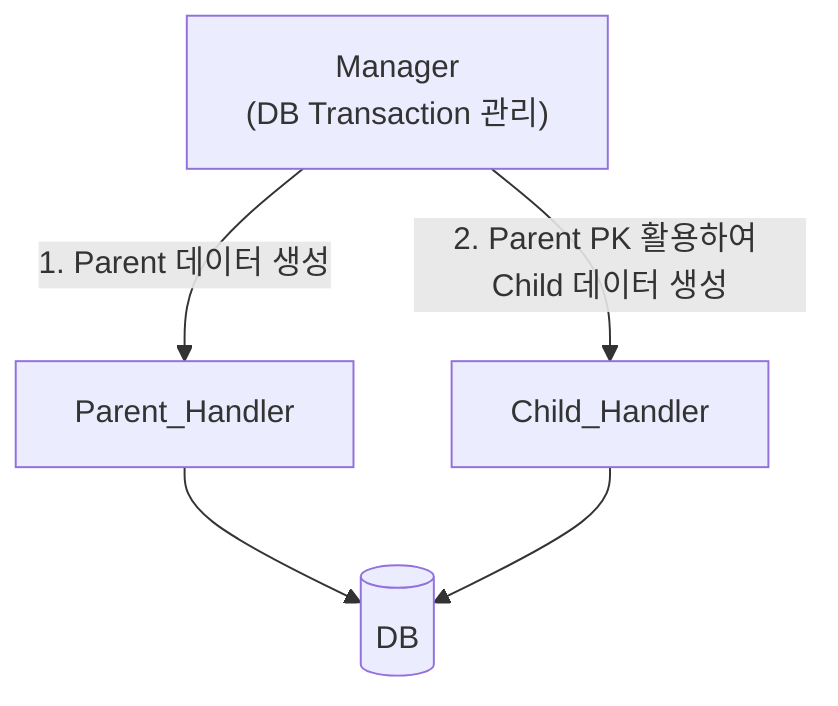
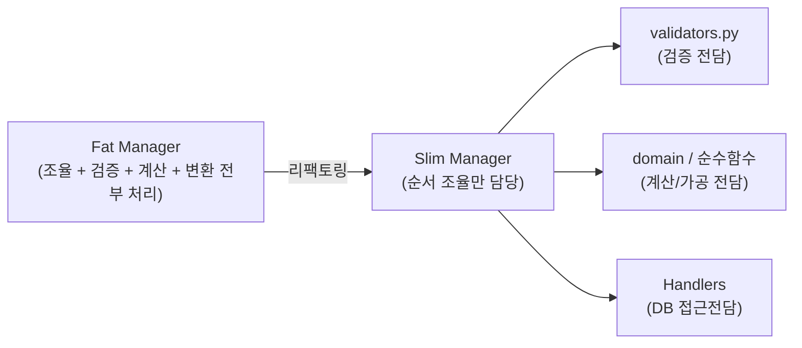

**한 줄** — `1 Table = 1 Handler`가 기본 원칙이다. 테이블 간 의존성이 있는 작업은 Manager가 동일한 DB 트랜잭션 내에서 여러 Handler를 순서대로 조율하며, Manager가 비대해지면 검증/계산 로직을 별도 모듈로 찢어내어 슬림하게 유지한다.
### 1. 레포지토리 폴더 구조 내 위치 관계
`modules/`는 도메인(기능 영역)별 경계이며, 그 안에 관련 `manager`와 `handler`가 함께 위치한다.

```plain text
app/
├── routers/
│   └── user_router.py          # HTTP 요청 처리 & 엔드포인트
└── modules/
    ├── user/                   # [User 도메인 Module]
    │   ├── user_handler.py     # User 테이블 단일 CRUD
    │   └── user_manager.py     # User 관련 여러 단계/흐름 조율
    └── graph_edit/            # [Graph Editing Module]
        ├── graph_edit_handler.py
        └── graph_edit_manager.py
```
- **`modules/`**: "무슨 도메인가?" (`account/`, `resource/`, `graph/` 등)
- **`handler`**: "단일 DB 테이블에 대한 Read/Write" (DB 쿼리 전담)
- **`manager`**: "이 도메인의 비즈니스 시나리오를 완성하기 위한 오케스트레이션(조율)"
### 2. 의존성이 있는 여러 테이블을 다루는 방법
원칙은 **1 Table (또는 1 Entity) = 1 Handler**이다. 테이블 간 의존성/연관관계가 있을 때는 아래 2가지 패턴으로 해결한다.
#### 패턴 1: \[기본/추천\] Handler 분리 + Manager 트랜잭션 조율
각 테이블의 쿼리는 각자 Handler가 담당하되, Manager가 동일한 DB Session(트랜잭션)으로 묶어서 순서대로 실행한다.

- **장점:** Handler의 역할이 단일 테이블 CRUD로 명확히 유지되고 재사용성이 올라감.
- **핵심:** 하나라도 실패 시 Manager의 `async with db_session.begin()`에 의해 전체 Rollback 처리.
#### 패턴 2: \[예외\] Aggregate Root (Parent Handler가 Child 통합 처리)
Child 테이블이 Parent 없이는 단독으로 조회/수정될 일이 **절대 없는 경우**, Parent Handler 하나에서 ORM Cascade나 JOIN을 통해 한 번에 처리한다.
<table>
<tr>
<td>**고민 상황**</td>
<td>**추천 패턴**</td>
<td>**핵심 이유**</td>
</tr>
<tr>
<td>**B가 A에 의존하지만, B만 단독 조회/수정할 일도 있는 경우**</td>
<td>**패턴 1 (Manager 조율)**</td>
<td>Handler는 쪼개고 Manager가 트랜잭션으로 묶어 호출</td>
</tr>
<tr>
<td>**B는 오직 A를 통해서만 생존/삭제되는 종속 관계인 경우**</td>
<td>**패턴 2 (Parent Handler 통합)**</td>
<td>Parent Handler 하나에서 Cascade/JOIN으로 일괄 처리</td>
</tr>
</table>
### 3. Manager가 거대해질 때 (Fat Manager) 리팩토링 전략
Manager가 비대해지는 진짜 이유는 DB 조율 외에 **검증(if/else), 데이터 가공, 상태 계산 로직**을 Manager가 직접 들고 있기 때문이다.


#### 리팩토링 3대 방향
1. **\[최우선\] 판단/검증/계산 로직 찢어내기 (Extract to Pure Functions)**
	- Manager에게서 `if/else` 조건문과 데이터 가공 로직을 밖으로 빼내어 `validators.py`나 순수 함수로 이전한다.
	- Manager는 오직 "1번 조회 → 2번 검증 → 3번 계산 → 4번 저장"의 지휘자(Conductor) 역할만 수행하도록 슬림화한다.
2. **Multiple Managers로 쪼개기**
	- 하나의 모듈 내에서도 기능 영역(연결, 권한, 외부 연동 등)이 확연히 나뉜다면 `resource_connection_manager.py`, `resource_access_manager.py`처럼 여러 Manager로 세분화한다.
3. **Handler Break Down 기준**
	- Handler는 **"1개 테이블 = 1개 Handler"** 기준이 깨져 여러 테이블 쿼리가 짬뽕되었을 때만 테이블 단위로 쪼갠다.
### 신입이 기억할 핵심 요약
✅
1. **단순 CRUD**는 `Router -> Handler`, **복잡한 흐름/의존성**은 `Router -> Manager -> Handler A, B`.
2. **의존성 있는 테이블 처리**는 Manager가 하나의 DB Session 트랜잭션 안에서 여러 Handler를 순서대로 불러 해결한다.
3. **Manager 리팩토링 핵심**은 Manager를 새로 더 만드는 것보다, Manager 내부의 **"직접 판단/계산하는 코드"를 순수 함수/검증 모듈로 밖으로 빼내는 것**이다.
🔗
태그: #architecture #backend #layer-responsibility #refactoring
