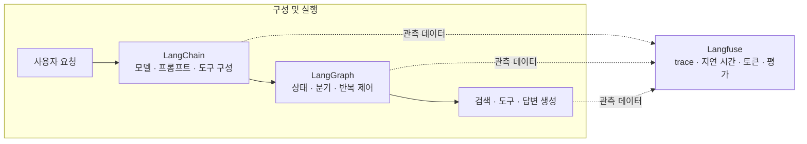

LangChain, LangGraph, Langfuse는 이름이 비슷해 함께 묶여 소개되지만 맡은 역할은 다르다. **LangChain은 모델과 도구를 이용해 에이전트를 구성하고, LangGraph는 복잡한 실행 흐름과 상태를 제어하며, Langfuse는 실행 과정을 기록하고 평가한다.**

## 한 줄로 구분하기

| 도구 | 하는 일 | 먼저 떠올릴 질문 |
| --- | --- | --- |
| **LangChain** | 모델, 프롬프트, 도구 같은 구성 요소를 엮어 LLM 애플리케이션과 에이전트를 만든다. | 어떤 구성 요소로 작업을 만들까? |
| **LangGraph** | 상태를 유지하는 여러 단계를 연결하고, 분기·반복·중단 후 재개 같은 실행 흐름을 다룬다. | 어떤 순서와 조건으로 실행할까? |
| **Langfuse** | LLM 요청과 도구·검색 단계의 trace를 모아 지연 시간, 사용량, 오류, 품질을 살펴본다. | 실행 중 무슨 일이 있었고 결과는 어땠을까? |

LangChain도 분기와 병렬 실행을 표현할 수 있다. 차이는 “직선 파이프라인인가, 그래프인가”가 아니다. LangGraph는 장시간 실행되거나 상태 보존, 재개, 사람의 승인 같은 제어가 필요한 워크플로를 세밀하게 다루는 데 초점을 둔다.

## 그림으로 보기

앞의 두 도구는 애플리케이션을 구성하고 실행한다. Langfuse는 그 실행을 바꾸는 또 하나의 단계라기보다, 실행 곳곳에서 나온 관측 데이터를 모아 분석하는 쪽이다.

이 그림은 역할을 설명하기 위한 단순화다. LangChain과 LangGraph는 항상 함께 써야 하는 것은 아니다. LangGraph는 독립적으로 사용할 수 있고, 현재 LangChain 에이전트 구현은 LangGraph의 실행 기능을 활용한다. Langfuse도 특정 프레임워크에만 묶이지 않고 다양한 LLM 애플리케이션을 관측할 수 있다.

각 도구 안에서 무엇이 일어나는지 조금 더 구체적으로 그리면 다음과 같다. **LangChain의 단계 연결, LangGraph의 분기와 재시도, Langfuse가 애플리케이션 바깥에서 실행을 관측하는 역할**을 나란히 볼 수 있다.

## RAG에 적용해 보면

사용자 질문을 받아 검색하고 답을 만드는 RAG를 떠올려 보자.

1. **LangChain**으로 모델, 프롬프트, 검색기, 도구 등 필요한 구성 요소를 연결한다.
2. 검색 방법을 선택하고, 결과가 부족하면 다시 검색하는 등 여러 단계의 흐름과 상태가 필요할 때 **LangGraph**로 제어한다.
3. 각 단계의 입력과 출력, 모델 호출, 걸린 시간과 토큰 사용량을 **Langfuse** trace에서 살펴보고 품질 점수와 함께 분석한다.

예컨대 답이 틀렸을 때 Langfuse에서 어느 검색 단계가 느렸거나 결과가 부족했는지 확인하고, LangGraph의 흐름이나 검색 구성을 조정할 수 있다. 관측은 문제를 찾는 데 도움을 주고, 오케스트레이션은 실제 실행 방식을 결정한다.

## 무엇부터 공부할까?

이미 LLM 호출과 RAG를 구현해 봤다면 기존 서비스에 Langfuse tracing을 붙여 요청 하나의 검색·생성 시간을 살펴보는 것이 시작하기 좋다. 다음으로 LangGraph에서 조건 분기와 상태 보존이 있는 작은 흐름을 만들어 본다. LangChain은 구성 요소와 에이전트가 실제 코드에서 어떻게 연결되는지 확인하면 두 도구와의 관계를 이해하기 쉽다.

도구 이름을 나열하는 것보다, 어떤 문제가 있어 도입했고 trace나 실행 흐름을 보고 무엇을 개선했는지 설명할 수 있는 편이 실력과 경험을 잘 보여준다.

## 참고 자료

- [LangChain 개요](https://docs.langchain.com/oss/python/langchain/overview)
- [LangGraph 개요](https://docs.langchain.com/oss/python/langgraph/overview)
- [Langfuse 관측과 tracing](https://langfuse.com/docs/observability/overview)
- [GeekNews: 개발 블로그 글쓰기의 안티패턴](https://news.hada.io/topic?id=34962)
